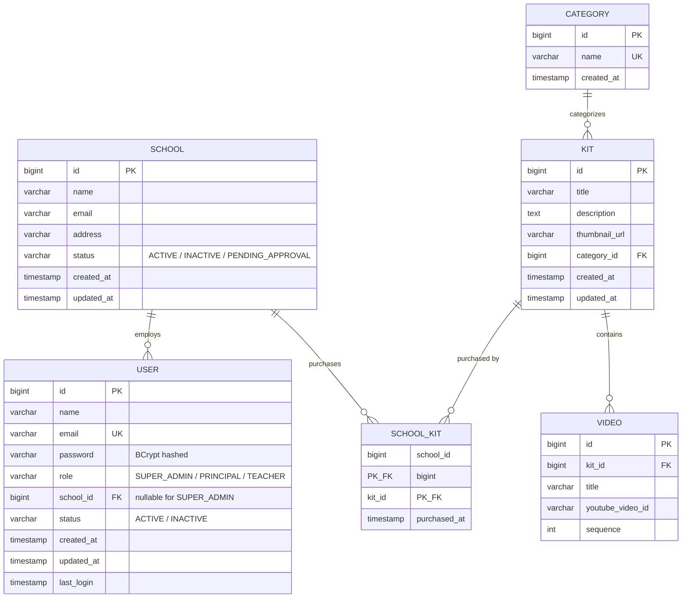

# Entity Relationship Diagram — Yntra Sparks MVP

**Status:** Draft v1 — Day 2
**Reflects decisions:** ADR-002 (no TeacherKit enforcement), ADR-003
(Category as entity), ADR-004 (status as enum-equivalent), ADR-008 (enums as
varchar via JPA)

## Diagram

## Notes

- **`TeacherKit` is intentionally not modeled.** Per ADR-002, all teachers in
  a school see all kits the school has purchased for MVP. Kit visibility for
  a Teacher is derived as: `User.school_id` → `SchoolKit` (where
  `school_id` matches) → `Kit`. If per-teacher assignment becomes a real
  requirement post-MVP, this table gets added without touching existing
  tables — additive migration only.

- **`User.school_id` is nullable.** Super Admins are not tied to a school.
  Any query that lists "users in a school" or "teachers in a school" must
  explicitly filter `WHERE school_id = :schoolId AND role != 'SUPER_ADMIN'`
  to avoid a null-school edge case leaking into school-scoped views.

- **Enums are `varchar`, not native Postgres `ENUM` types.** Per ADR-008,
  validated at the application layer via `@Enumerated(EnumType.STRING)` in
  JPA. Allowed values are documented above per field.

- **`SchoolKit` has a composite primary key** (`school_id`, `kit_id`) — a
  school cannot purchase the same kit twice; re-purchasing/renewal logic is
  out of scope for MVP.

- **Soft delete, not hard delete, for `User` and `School`.** "Deactivate" in
  the requirements doc means flipping `status` to `INACTIVE`, never an actual
  `DELETE` row. This preserves referential integrity (a deactivated teacher's
  historical data isn't orphaned) and is required for any future audit trail.
  Decision: implicitly assumed, but worth confirming explicitly — recommend
  adding as ADR-009 if agreed.

- **`Kit` deletion behavior is undecided.** Super Admin has "Add/Edit/Delete
  Kits" per the original spec — but if a school has purchased a kit
  (`SchoolKit` row exists), hard-deleting the `Kit` row would break that
  school's access. Recommend Kit deletion also be a soft delete
  (`status` or `archived` flag) rather than a real `DELETE`, consistent with
  User/School. Flag this as an open question before backend work starts.

## Open Questions From This Diagram

| # | Question | Status |
|---|----------|--------|
| 1 | Confirm soft-delete (status flip) for User/School, not hard delete | Open |
| 2 | Kit deletion: soft delete (archive) vs hard delete, given SchoolKit dependency | Open |
| 3 | Does `SchoolKit.purchased_at` need an expiry/renewal date for future subscription model? | Deferred — not MVP |