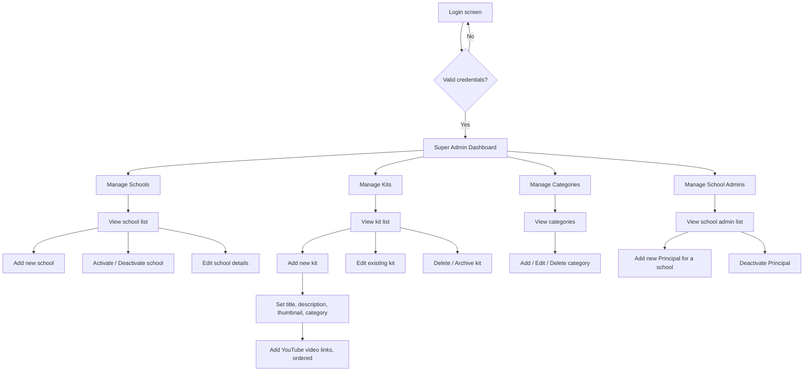
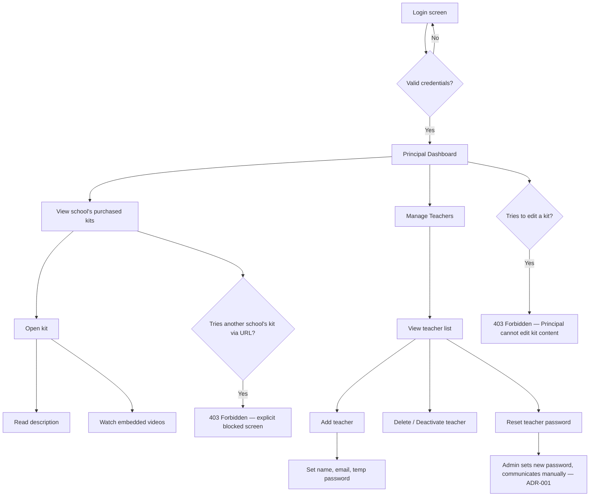
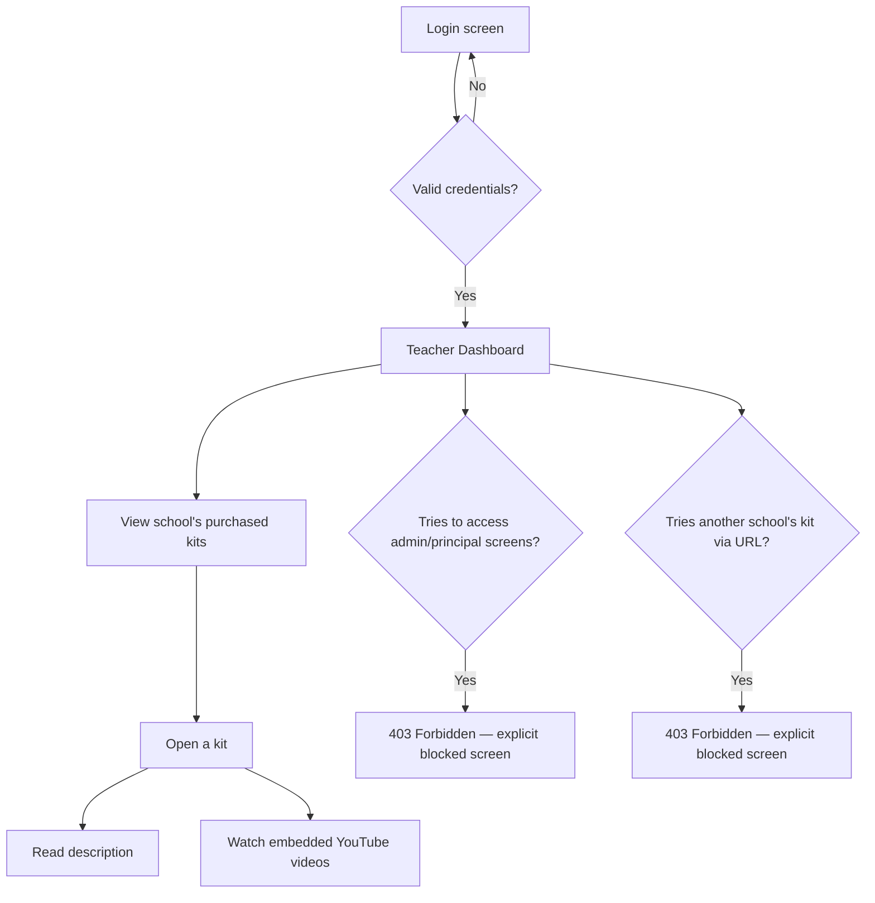

# User Flows — Yntra Sparks MVP

**Status:** Draft v1 — Day 2

Three roles, three flows. Each shows the actual click-path from login to
core action, including the blocked/error states that the requirements doc
(§6 Non-Functional Requirements) requires — a user must see an explicit
403/blocked state, never a silent empty screen, when trying to access
something outside their scope.

## 1. Super Admin Flow

## 2. Principal (School Admin) Flow

## 3. Teacher Flow

## Cross-Cutting Notes

- **Every blocked-state arrow above is a hard requirement, not a nice-to-have.**
  Per `requirements.md` §6: a Principal or Teacher hitting another school's
  resource gets a real 403 response, enforced at the API layer — the
  frontend route guard is a UX convenience, not the actual security
  boundary. Both layers must independently enforce this.

- **Login flow is shared across all three roles** (same screen, same
  endpoint) — role is determined server-side from the JWT claims after
  login, then the frontend redirects to the correct dashboard based on
  `role`. There is no separate login URL per role.

- **Password reset (Teacher side) is never self-service** — per ADR-001,
  only a Principal can trigger a reset for a teacher in their school. This
  is reflected in the Principal flow (E4) and intentionally absent from the
  Teacher flow.

## Open Questions From These Flows

| # | Question | Status |
|---|----------|--------|
| 1 | On first login with a temp password, is a forced password-change step required? | Open — recommend yes, standard practice for admin-set passwords |
| 2 | Does Super Admin dashboard need a landing/overview page, or direct to Manage Schools? | Open — low priority, UX polish |